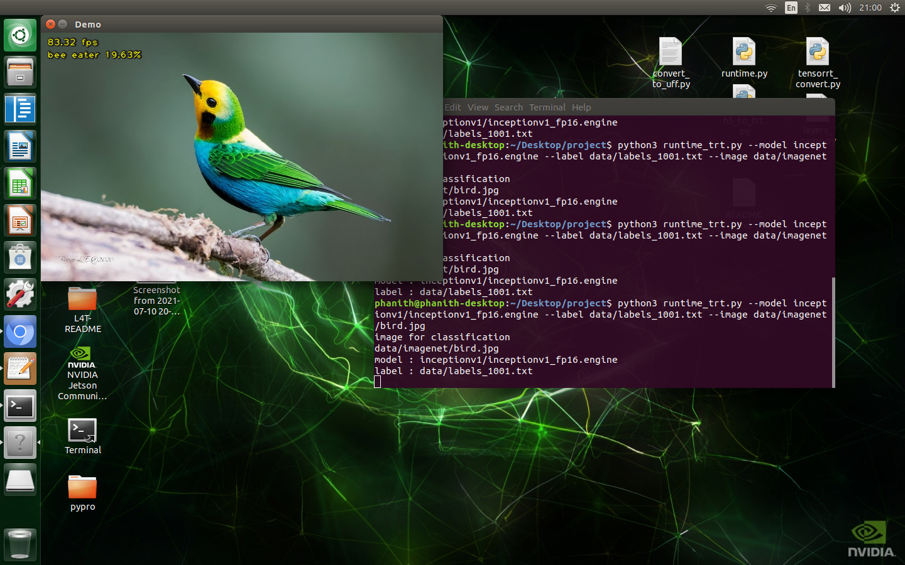
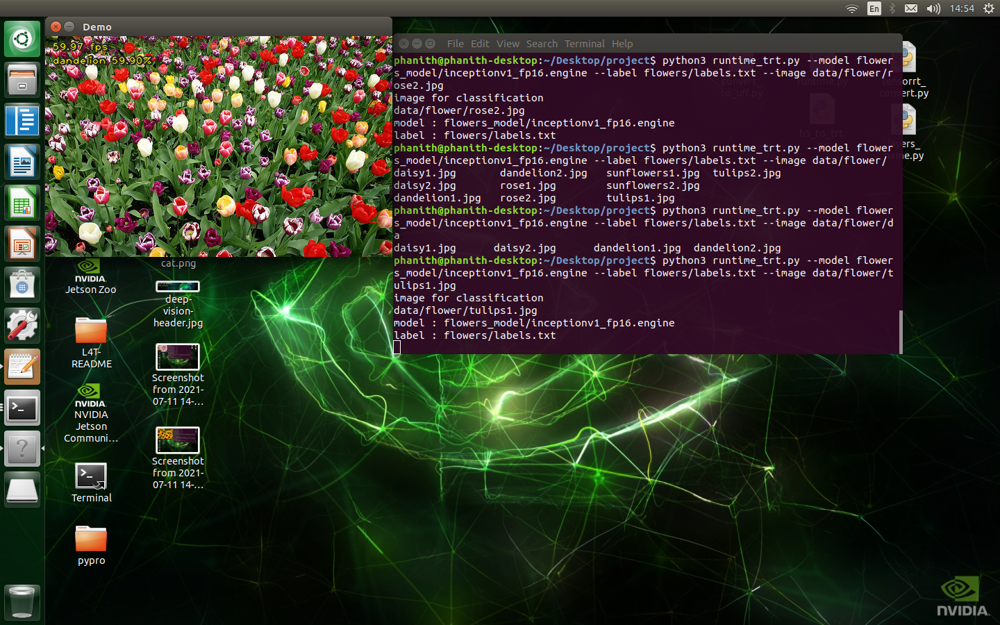
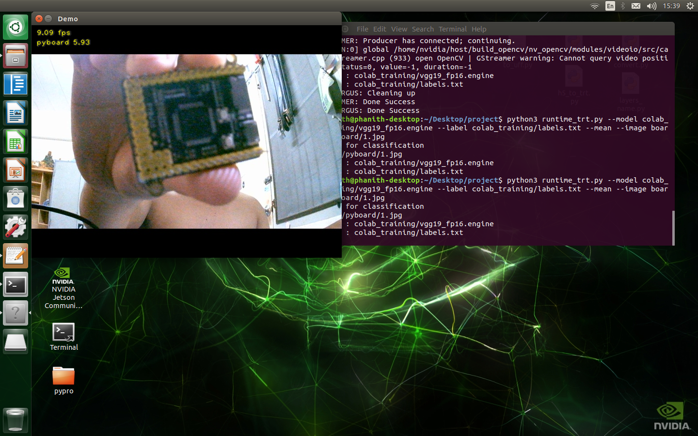
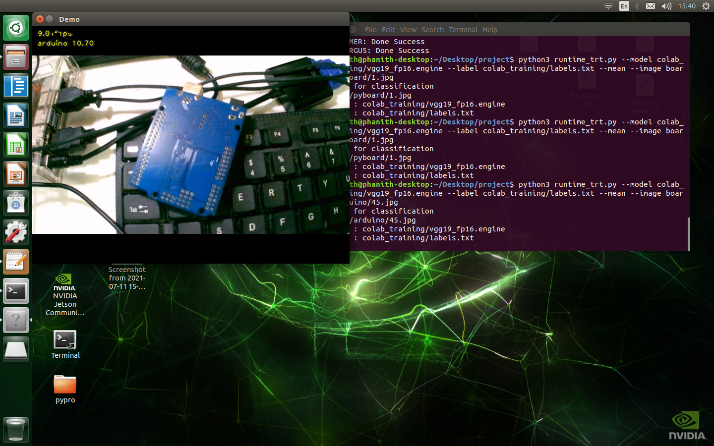

Deploying Deep Learning Model Image Classification TensorFlow1 to TensorRT on Jetson Nano
====================================

<p align="center">

</p>

This repository was from NVIDIA's [tf_trt_models](https://github.com/NVIDIA-Jetson/tf_trt_models) repository. About repository uses NVIDIA **[TensorRT](https://developer.nvidia.com/tensorrt)** for deploying neural networks onto the embedded Jetson Nano platform, improving performance by optimizations from frozen graph model tensorflow1, kernel fusion, and FP32/FP16 precision. Jetson Nano doesn't support with INT8 precision, so we will guide you inference and realtime with CPU, GPU, FP32 and FP16 then make some compare between different inference. The models are sourced from the [TensorFlow models repository](https://github.com/tensorflow/models/tree/master/research/slim)

### Table of Contents

* [Setup](#setup)
* [Convert checkpoint to frozen graph model](#convert-checkpoint-to-frozen-graph-model)
* [Convert frozen graph to tensorrt engine](#convert-frozen-graph-to-tensorrt-engine)
* [Inference with cpu and gpu](#inference-with-cpu-and-gpu)
* [Inference with tensorrt](#inference-with-tensorrt)
* [Result Inference Model ](#result-inference-model)
* [Fine tuning flowers dataset and deploy](#fine-tuning-flowers-dataset-and-deploy)
* [Prepare custom dataset](#prepare-custom-dataset)
* [Fine tuning on google colab](#fine-tuning-on-google-colab)

## Setup
-----

1. First time Jetson Nano once your device has been flashed with JetPack or setup with the pre-populated [SD Card Image](https://developer.nvidia.com/embedded/learn/get-started-jetson-nano-devkit#write). Jetpack that I test with is Jetpack 4.5.1 include: CUDA=10.2, OPENCV=4.1.1, TensorRT=7.1, cuDNN 8.0 was pre-install on this SD Card Image.
2. Clone this repository
 	```ini
 	cd ~
   	git clone https://github.com/SokPhanith/tf1_tensorrt_image_classification_jetson_nano.git
   	cd tf1_tensorrt_image_classification_jetson_nano
 	```  	
3. CUDA toolkit related paths are not set in the environment variables fix that by run :
    	
	```
 	bash scripts/install_basics.sh
 	```
	
4. Install Tensorflow1 on Jetson Nano 
    	
	```
 	bash scripts/install_tensorflow.sh
 	``` 
	
5. Install pycuda on Jetson Nano
    	
	```
 	bash scripts/install_pycuda.sh
	```
 	
6. Install slim model repository on Jetson Nano
	
	```
 	bash scripts/install_tf1_slim.sh
 	``` 
	
7. Clone tensorflow1 repository using python API tool frozen graph convert
    	
	```
 	bash scripts/install_tf1_tool.sh
 	```
	
8. Fix some issue for python file at path TF-models/research/slim/datasets/imagenet.py
    	
	```
 	bash scripts/fix_tf1_slim.sh
 	```
	
9. Add more swap memory on jetson nano by default 2GB
	```
 	git clone https://github.com/JetsonHacksNano/installSwapfile
	cd installSwapfile
	./installSwapfile
	sudo reboot
 	```
## Convert checkpoint to frozen graph model
-----

On my repository in folder download have a scripts to get checkpoint from [TensorFlow models repository](https://github.com/tensorflow/models/tree/master/research/slim) slim model. Let's get start example with inceptionv1.
Download checkpoint.
	
	
 	cd ~
	cd tf1_tensorrt_image_classification_jetson_nano
	bash download/inceptionv1.sh
 	
	
Exporting the inference graph out a GraphDef containing the architecture of the model.

 	python3 TF-models/research/slim/export_inference_graph.py \
	  	--alsologtostderr \
	  	--model_name=inception_v1 \
		--output_file=inceptionv1/inception_v1_inf_graph.pb 


!!Note: If you exporting with resnetv1 or vgg-net you must set labels_offset=1 because that model convert from original caffe model to tensorflow1 model like:
	
	
 	python3 TF-models/research/slim/export_inference_graph.py \
	  	--alsologtostderr \
	  	--model_name=resnet_v1_50 \
	  	--output_file=resnet_v1_50/resnet_v1_50_inf_graph.pb \
		--labels_offset=1 

Convert to frozen graph model with python API tool tensorflow1

 	python3 tensorflow/tensorflow/python/tools/freeze_graph.py \
	  	--input_graph=inceptionv1/inception_v1_inf_graph.pb  \
	  	--input_checkpoint=inceptionv1/inception_v1.ckpt  \
	  	--input_binary=true \
		--output_graph=inceptionv1/inception_v1.pb \
	  	--output_node_names=InceptionV1/Logits/Predictions/Reshape_1

You will see frozen graph model of inceptionv1 in folder inceptionv1.
If you want getting start with another model that support with slim model, you can download by using scripts on downlaod folders directory, we have a summary like table below. Everytime Before run python3 tensorflow/tensorflow/python/tools/freeze_graph.py, you must know output_node_names or output_name layer of your frozen graph. you can check input_name and output_node_names(output_name) by python file layers_name.py or table below.
	
	python3 layers_name.py inceptionv1/inception_v1_inf_graph.pb 
	
### Table
| model_name | input size | input_name | output_node_names(output_name) |
|:-----------:|:----------:|:-----------:|:-------------------------------:|
| inception_v1 | 224x224 | input | InceptionV1/Logits/Predictions/Reshape_1 |
| inception_v2 | 224x224 | input | InceptionV2/Predictions/Reshape_1 |
| inception_v3 | 299x299 | input | InceptionV3/Predictions/Reshape_1 |
| inception_v4 | 299x299 | input | InceptionV4/Logits/Predictions |
| inception_resnet_v2 | 299x299 | input | InceptionResnetV2/Logits/Predictions |
| resnet_v1_50 | 224x224 | input | resnet_v1_50/predictions/Reshape_1 |
| resnet_v1_101 | 224x224 | input | resnet_v1_101/predictions/Reshape_1 |
| resnet_v1_152 | 224x224 | input | resnet_v1_152/predictions/Reshape_1 |
| resnet_v2_50 | 224x224 | input | resnet_v2_50/predictions/Reshape_1 |
| resnet_v2_101 | 224x224 | input | resnet_v2_101/predictions/Reshape_1 |
| resnet_v2_152 | 224x224 | input | resnet_v2_152/predictions/Reshape_1 |
| mobilenet_v1 | 224x224 | input | MobilenetV1/Predictions/Reshape_1 |
| mobilenet_v2 | 224x224 | input | MobilenetV2/Predictions/Reshape_1 |
| vgg_16 | 224x224 | input | vgg_16/fc8/squeezed |
| vgg_19 | 224x224 | input | vgg_19/fc8/squeezed |
| nasnet_mobile | 224x224 | input | final_layer/predictions |
| pnasnet_mobile | 224x224 | input | final_layer/predictions |
| nasnet_large | 331x331 | input | final_layer/predictions |
| pnasnet_large | 331x331 | input | final_layer/predictions |

# Out of Memory
 
For vgg16, vgg19, resnet_v2_152, resnet_v1_152, nasnet_large, pnasnet_large and inception_resnet_v2 is a big model,alot of layers convert to frozen graph on jetson nano not enough memory, so I have a notebook on folder colab name: "checkpoint_tf1_convert_freeze_graph.ipynb", That notebook guide you how to convert frozen graph model on google colab Free GPU just follow step by step you will get vgg16 or vgg19 frozen graph model. Click it by [Getting Start](https://colab.research.google.com/drive/1zUfR_Q8XYtFw6x1UA5EHkJo2G-DXZgy0) or go to google colab upload my notebook and then go forward.

## Convert frozen graph to tensorrt engine

After you have a frozen graph model before convert to tensorrt engine, you must convert to the Universal Framework Format (UFF) with tensorflow1. By the way when you install tensorflow1 on your jetson nano python API tool was has tool. you can find it on this path.

	python3 /usr/lib/python3.6/dist-packages/uff/bin/convert_to_uff.py --help

In my repository also have a convert_to_uff.py, I just copy from that path. you can convert to uff format by run.

	cd ~
	cd tf1_tensorrt_image_classification_jetson_nano
	python3 /usr/lib/python3.6/dist-packages/uff/bin/convert_to_uff.py inceptionv1/inception_v1.pb
	
or

	cd ~
	cd tf1_tensorrt_image_classification_jetson_nano
	python3 convert_to_uff.py inceptionv1/inception_v1.pb 
	
you will see inception_v1.uff in the same root directory with inception_v1.pb frozen graph. after that you can build tensorrt engine.

For FP16 precision

	python3 tensorrt_convert.py --model=inceptionv1/inception_v1.uff  \
			--output=inceptionv1/inception_v1_fp16.engine  \
			--input_name=input \
			--output_name=InceptionV1/Logits/Predictions/Reshape_1 \
			--fp16 \
			--height=224 \
			--width=224 \
			--batch_size=1 

For FP32 precision

	python3 tensorrt_convert.py --model=inceptionv1/inception_v1.uff  \
			--output=inceptionv1/inception_v1_fp32.engine  \
			--input_name=input \
			--output_name=InceptionV1/Logits/Predictions/Reshape_1 \
			--height=224 \
			--width=224 \
			--batch_size=1 
		
## Inference with cpu and gpu

After convert frozen graph, before inference I recommend close someting like WebBrowser and another software to save your memory next just open your Ternimal you can inference with simple gpu or cpu by python like below :
	
maximum performance by running these commands

	sudo nvpmodel -m 0
	sudo jetson_clocks

For GPU with image

	cd ~
	cd tf1_tensorrt_image_classification_jetson_nano
	python3 runtime_simple.py --model=inceptionv1/inception_v1.pb  \
		--input_name=input \
		--output_name=InceptionV1/Logits/Predictions/Reshape_1 \
		--label data/labels_1001.txt \
		--image=data/imagenet/bird.jpg 

For cpu with image

	python3 runtime_simple.py --model=inceptionv1/inception_v1.pb  \
		--input_name=input \
		--output_name=InceptionV1/Logits/Predictions/Reshape_1 \
		--label data/labels_1001.txt \
		--image=data/imagenet/bird.jpg \
		--cpu 

CSI Raspberrypi camera v2

	python3 runtime_simple.py --model=inceptionv1/inception_v1.pb  \
		--input_name=input \
		--output_name=InceptionV1/Logits/Predictions/Reshape_1 \
		--label data/labels_1001.txt \
		--image=data/imagenet/bird.jpg \
		--csi 

Webcam

	python3 runtime_simple.py --model=inceptionv1/inception_v1.pb  \
		--input_name=input \
		--output_name=InceptionV1/Logits/Predictions/Reshape_1 \
		--label data/labels_1001.txt \
		--image=data/imagenet/bird.jpg \
		--webcam 0

Video

	python3 runtime_simple.py --model=inceptionv1/inception_v1.pb  \
		--input_name=input \
		--output_name=InceptionV1/Logits/Predictions/Reshape_1 \
		--label data/labels_1001.txt \
		--image=data/imagenet/bird.jpg \
		--video data/video/jellyfish.mkv

!!Note
If you exporting with resnetv1 or vgg-net for inference, you must set --mean for inference too. because caffe model was training different preprocessing with tensorflow1:

## Inference with tensorrt

Before you run inference with tensorrt you must have tensorrt engine file. Before inference I recommend close someting like WebBrowser and another software to save your memory next just open your Ternimal you can inference with tensorrt engine optimizations like below :

	
maximum performance by running these commands

	sudo nvpmodel -m 0
	sudo jetson_clocks

For FP16 precision with image
	
	cd ~
	cd tf1_tensorrt_image_classification_jetson_nano
	python3 runtime_trt.py --model=inceptionv1/inception_v1_fp16.engine  \
		--label data/labels_1001.txt \
		--image=data/imagenet/bird.jpg 

For FP32 precision with image

	python3 runtime_trt.py --model=inceptionv1/inception_v1_fp32.engine  \
		--label data/labels_1001.txt \
		--image=data/imagenet/bird.jpg 

CSI Raspberrypi camera v2

	python3 runtime_trt.py --model=inceptionv1/inception_v1_fp16.engine  \
		--label data/labels_1001.txt \
		--csi

Webcam

	python3 runtime_trt.py --model=inceptionv1/inception_v1_fp16.engine  \
		--label data/labels_1001.txt \
		--webcam 0

Video
	
	python3 runtime_trt.py --model=inceptionv1/inception_v1_fp16.engine  \
		--label data/labels_1001.txt \
		--video data/video/jellyfish.mkv


!!Note:
If you exporting with resnetv1 or vgg-net for inference, you must set --mean for inference too. Because caffe model was training different preprocessing with tensorflow1

## Result Inference Model

Inference with a simple image cat.jpg 900x675 resolution
|     MODEL    |   FP16  |   FP32  |   GPU   |   CPU  |
|:-------------:|:-------:|:--------:|:--------:|:-------:|
| inception_v1 | 82.1FPS | 48.1FPS | 20.5FPS | 5.5FPS |
| inception_v2 | 61.0FPS | 37.9FPS | 14.2FPS | 4.1FPS |
| inception_v3 | 22.2FPS | 12.0FPS | 5.3FPS | 1.6FPS | 
| inception_v4 | 10.8FPS | 5.7FPS | 2.9FPS | 0.8FPS | 
| inception_resnetv2 | 9.8FPS | 5.1FPS | 2.4FPS | 0.7FPS |
| resnetv1_50 | 37.8FPS | 21.1FPS | 6.1FPS | 2.2FPS |
| resnetv1_101 | 20.9FPS | 11.6FPS | 3.5FPS | 1.1FPS |
| resnetv1_152 | 14.6FPS | 7.9FPS | 2.6FPS | 0.8FPS | 
| resnetv2_50 | 33.1FPS | 19.8FPS | 5.5FPS | 2.1FPS |
| resnetv2_101 | 18.4FPS | 10.9FPS | 3.4FPS | 0.9FPS |
| resnetv2_152 | 12.6FPS | 7.4FPS | 2.4FPS | 0.7FPS |
| mobilenetv1_224x224 | 79.0FPS | 69.1FPS | 25.3FPS | 9.6FPS |
| mobilenetv1_160x160 | 266.0FPS | 256.0FPS | 64.0FPS | 35.0FPS |
| mobilenetv1_128x128 | 430.0FPS | 301.0FPS | 66.0FPS | 61.0FPS |
| mobilenetv2_1.0 | 72.6FPS | 67.8FPS | 23.1FPS | 11.5FPS |
| mobilenetv2_1.4 | 48.3FPS | 44.3FPS | 13.3FPS | 7.6FPS |
| vgg_16 | 12.6FPS | 6.8FPS | - | 0.5FPS |
| vgg_19 | 10.0FPS | 5.8FPS | - | 0.4FPS |
| nasnet_mobile | - | - | 7.2FPS | 6.0FPS |
| pnasnet_mobile | - | - | 9.4FPS | 5.4FPS |
| nasnet_large | - | - | - | - |
| pnasnet_large | - | - | - | - |


!!Note: 
nasnet and pnasnet have a bit issue for convert to tensorrt engine, I will try fix it out and update soon. vgg_16 and vgg_19 inference with gpu simple jetson nano not enough memory issue. If you inference with csi raspberrypi camera v2, webcam or video, you will drop aliite bit FPS and also If you don't run command maximum performance.

## Fine tuning flowers dataset and deploy

This part we will guide you to Fine Tuning flowers dataset from tensorflow with inceptionv1 Jetson Nano and then deploying model to tensorrt engine. we'll need to download the raw data and convert it to TensorFlow's native TFRecord format because slim model support TFRecord dataset for training.
	
Download dataset and convert to TFRecord

	cd ~
	cd tf1_tensorrt_image_classification_jetson_nano
	python3 TF-models/research/slim/download_and_convert_data.py --dataset_name=flowers --dataset_dir=flowers

 Fine tuning with inceptionv1
 
 	python3 TF-models/research/slim/train_image_classifier.py --train_dir flowers_model \
		--dataset_name flowers \
		--dataset_split_name train \
		--dataset_dir flowers \
		--model_name inception_v1 \
		--checkpoint_path inceptionv1/inception_v1.ckpt \
		--checkpoint_exclude_scopes=InceptionV1/Logits \
		--trainable_scopes=InceptionV1/Logits \
		--max_number_of_steps=4000 \
		--batch_size 4 \
		--save_interval_secs=60 \
		--save_summaries_secs=60 \
		--log_every_n_steps=100 \
		--learning_rate=0.001 

validation checkpoint

	python3 eval_image_classifier.py --model_name inception_v1 \
		--eval_dir flowers_model \
		--dataset_split_name validation \
		--dataset_name flowers \
		--dataset_dir flowers/ \
		--checkpoint_path flowers_model/ 
		--batch_size 4

You can look for your result training and validation by tensorboard :

	tensorboard --logdir flowers_model/

Deploying to tensorrt engine with FP16 precision
Exporting the inference graph out a GraphDef containing the architecture of the model.

	python3 TF-models/research/slim/export_inference_graph.py \
		--alsologtostderr \
		--dataset_dir flowers \
		--dataset_name flowers \
	  	--model_name=inception_v1 \
	  	--output_file=flowers_model/inception_v1_inf_graph.pb 

Convert to frozen graph model with python API tool tensorflow1

	python3 tensorflow/tensorflow/python/tools/freeze_graph.py \
	  	--input_graph=flowers_model/inception_v1_inf_graph.pb  \
	  	--input_checkpoint=flowers_model/model.ckpt-4000  \
	  	--input_binary=true \
		--output_graph=flowers_model/inception_v1.pb \
	  	--output_node_names=InceptionV1/Logits/Predictions/Reshape_1

Build tensorrt engine

	python3 convert_to_uff.py flowers_model/inception_v1.pb
	python3 tensorrt_convert.py --model=flowers_model/inception_v1.uff  \
		--output=flowers_model/inception_v1_fp16.engine  \
	  	--input_name=input \
		--output_name=InceptionV1/Logits/Predictions/Reshape_1 \
	  	--fp16 
Inference

	python3 runtime_trt.py --model flowers_model/inception_v1_fp16.engine \
		--label flowers/labels.txt \
		--image data/flower/tulips1.jpg 


<p align="center">

</p>

## Prepare custom dataset

You can prepare your own custom dataset by my python file camera_tool.py.This tool will take a image from webcam or CSI raspberrypi camera v2. Fisrt you must have a classes.txt file that show you one by one of your single class :
	
	classes.txt look like : 
	
		arduino
		cnc
		esp8266
		pyboard
   
After then you can start collent image by running :
csi camera 

	python3 camera_tool.py --dataset_dir board --label classes.txt --csi

Webcam 

	python3 camera_tool.py --dataset_dir board --label classes.txt --webcam 0

*press s for save 
*press c for change class
*press q for exit

Convert to TFRecord format by using python tfrecord_convert.py

	python3 tfrecord_convert.py --dataset_dir board --num_test 100

Finally, you will see tfrecord format train and valdation in board folders. you can fine tuning on it like Fine tuning flowers dataset and deploy

## Fine tuning on google colab

If you want Fine tuning with big model like : vgg16, vgg19, resnet_v2_152, resnet_v1_152, nasnet_large, pnasnet_large and inception_resnet_v2, jetson nano cant not Fine tuning because out of memory but you can fine tuning on google colab FREE GPU. Dataset you can fine tuning on google colab with my notebook in folder colab name : training_slim_image_classification.ipynb. 

First you must prepare custom dataset like above Prepare custom dataset step and convert to TFRecord too. example look like :  

	board --> folder
		arduino --> image arduino
		cnc --> image cnc
		esp8266 --> image esp7266
		pyboard --> image pyboard
		labels.txt -->	0:arduino
				1:cnc
				2:esp8266
				3:pyboard
		flowers_train_00000-of-00004.tfrecord
		flowers_train_00001-of-00004.tfrecord
		flowers_train_00002-of-00004.tfrecord
		flowers_train_00003-of-00004.tfrecord
		flowers_validation_00000-of-00004.tfrecord
		flowers_validation_00001-of-00004.tfrecord
		flowers_validation_00002-of-00004.tfrecord
		flowers_validation_00003-of-00004.tfrecord
	
rename folder to dataset like :

	dataset --> folder
		arduino --> image arduino
		cnc --> image cnc
		esp8266 --> image esp7266
		pyboard --> image pyboard
		labels.txt -->	0:arduino
				1:cnc
				2:esp8266
				3:pyboard
		flowers_train_00000-of-00004.tfrecord
		flowers_train_00001-of-00004.tfrecord
		flowers_train_00002-of-00004.tfrecord
		flowers_train_00003-of-00004.tfrecord
		flowers_validation_00000-of-00004.tfrecord
		flowers_validation_00001-of-00004.tfrecord
		flowers_validation_00002-of-00004.tfrecord
		flowers_validation_00003-of-00004.tfrecord
compress folder dataset to dataset.zip than upload to your google drive
Click [Getting Start](https://colab.research.google.com/drive/1Q-TgWGdT3AhlepLoPK_waJ2rssPRhfbI) or upload my notebook to google colab and then go forward.
# Example image fine tuning vgg_19 on google colab and inference

<p align="center">

</p>

<p align="center">

</p>

# References
 - [tensorrt_demos](https://github.com/jkjung-avt/tensorrt_demos)
 - [TensorFlow models repository](https://github.com/tensorflow/models/tree/master/research/slim)
